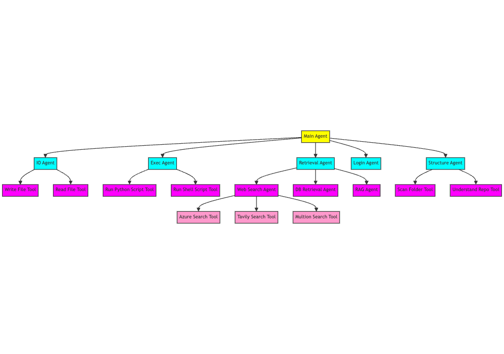

# 0716 SPC

## 1. Multi-agent Framework

| Framework | Workflow-driven | Flexibility | Function Calling  |
|-----------|-----------------|-------------|-------------------|
| LangGraph | Yes             | Developed by LangChain team | Yes               |
| CrewAI    | No, in a crew   | Relies on LangChain          | Yes               |
| AutoGen   | No, in a group chat | Written from scratch | Yes               |
| MetaGPT   | No, in a team, but can design dependencies | Written from scratch, a lot of prompting | Limited          |

### (1) CrewAI
- [CrewAI GitHub](https://github.com/joaomdmoura/crewai)
- **Get Started**:
  - A crew is a group chat of AutoGen and a team of MetaGPT.
  - Fully integrated with function calling
  - Code interpreter support is limited.
  - Uses LangChain, Agents in CrewAI are essentially ReAct agents coded with LangChain.
- **Recommendation**: 
  - If your task is not related to coding or debugging, only prompting and API calling, consider using CrewAI. It's easy to config and it already has some tools implemented.
  - But it is built on top of LangChain, so might be hard to debug

### (2) LangGraph
- **Get Started**:
  - **Workflow** driven agent/multi-agent framework
    - If we define the prompt really well and pass the right set of tools, we don't need workflow.
    - Later on, LLM can be better at designing workflows, and we won't need workflow.
    - We don't need that many different types of workflows since by doing that, we are just implementing a hard-coded rule. It's not really agentic!
    - The graph framework is general enough to take either function or agent as a graph node.
  - Its conditional edges handle iterative debugging and make it different from a rule-based for loop of prompting.
    - Works fine when there is no error but doesn't work well when there are bugs and errors.

- **Recommendation**
  - There is some learning curve when you try to build your own graph. In general, it is not that hard to use but really limits the agent capacity to a very specific use case.
  - **Recommendation**: If you want to make your multi-step prompting (workflow-based agent) more robust, consider using LangGraph after you finish the sequential prompting-based approach.

### (3) AutoGen
[AutoGen](https://arxiv.org/abs/2308.08155) provides a multi-agent conversation framework as a high-level abstraction. With this framework, one can conveniently build LLM workflows.
- **Get Started**:
  - **Two types of agents**:
    - `autogen.UserProxyAgent`: This allows human in the loop.
    - `autogen.AssistantAgent`: Automated agent.
  - **When to Terminate**
    - `self.groupchat = autogen.GroupChat(agents=[self.debugger, self.swe, self.pm], messages=[], max_round=10)`
    - `self.manager = autogen.GroupChatManager(groupchat=self.groupchat, llm_config=llm_config, is_termination_msg=lambda x: x.get("content", "").rstrip().find("TERMINATE") >= 0)`

- **Recommendations**
  - Fairly easy to modify to create a new system.
  - Integrates well with function calling.
  - Easy integration of human in the loop by changing `autogen.AssistantAgent` to `autogen.UserProxyAgent` and changing human_input_mode.
  - No real workflow defined; agents are simply put together in a group chat and take action one by one.
    - The conversational multi-agent framework might not be the ideal multi-agent setting.
  - If you want to focus on proof of concept, AutoGen is a good starting point.

### (4) MetaGPT
[MetaGPT](https://openreview.net/forum?id=VtmBAGCN7o) is a framework designed for programming in multi-agent collaborative environments, specifically utilizing the Large Language Model (LLM).
- **Get Started**:
  - [MetaGPT GitHub](https://github.com/geekan/MetaGPT/tree/main)
  - `metagpt --init-config` to configure the OpenAI key.
  - It's a dynamic graph of agents connected by their actions. It has a simple workflow on `self._watch`, which means, after some actions are taken, some roles can take some action.
  - Prompt-based, no native usage of function calling.

- **Recommendation**:
  - The whole framework was written before function calling really worked last winter, so a lot of prompting work in their tool design. A lot of prompt engineering work is needed.
  - The performance is unstable, and it will be non-trivial to add new functions (aka actions) and agents (aka roles) in the MetaGPT framework.
  - **Recommendation**: As of 07/2024, it's not recommended to onboard this framework.

## Single-agent Reimplementation of Multi-agent examples
* examples
  * coding and debugging
    * define five tools
      * write to file tool
      * python code execution tool
  * research and plot
    * define three tools:
      * tavily search tool
      * write to file tool
      * python code execution tool
* my conclusion 
  * For most multi-agent collaboration tasks, where each agent has a different set of tools, we can reimplement them with function calling by passing the tools to one agent. 
  * However, if the task is very complicated and requires multiple tools to be passed to the LLM, it will take too many prompt tokens. From an efficiency and cost perspective, passing all tools to one agent is not ideal.

## Multi-agent Framework
- One main agent with hierarchical agent management, sub-agent in charge of a specific task.
  - simple demo: research and plot/ summarize: https://github.com/Tata0703/AI_agents/tree/main/0719_SPC/multi_agent/research_summarize
    - web_search agent, has two tools
      - tavily_search
      - multio_search
    - other existing tools as the single agent framework
  - The sub-agent, use_search_agent, is used as a tool for the main agent.
```python
available_tools = {
            "write_to_file": write_to_file,
            "read_file": read_file,
            "scan_folder": scan_folder,
            "run_python_script": run_python_script,
            "execute_shell_command": execute_shell_command,
            "use_search_agent": use_search_agent,
        }
```
The agent hierarchy of main agent

- [MultiAgent GitHub](https://github.com/PathOnAI/MultiAgent)
  - Initial version working. Will maintain this as open-source project.
  - I have modified this framework to make it work for web agents.


## Onboarding

### (1) Framework
For each framework, go to the corresponding folder of each environment, and install the Python environment by running the following commands:
```bash
$ python3 -m venv venv
$ . venv/bin/activate
$ pip install -r requirements.txt
```
Create a .env file, and update your API keys:

```bash
cp env.example .env
```
For AutoGen, you also need to create the OAI_CONFIG_LIST file in the AutoGen folder:

```bash
cp OAI_CONFIG_LIST_sample OAI_CONFIG_LIST
```

### (2) Single and Multi-Agent from Scratch
Use the requirements.txt file in the 0719_SPC_multiagent folder:

```bash
python3 -m venv venv
. venv/bin/activate
pip install -r requirements.txt
```

Feel free to ask if you need further assistance or modifications!

